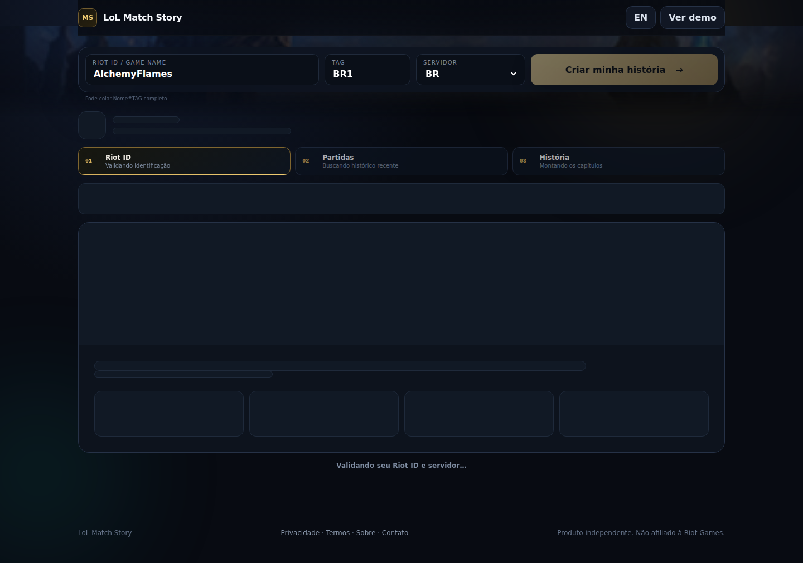
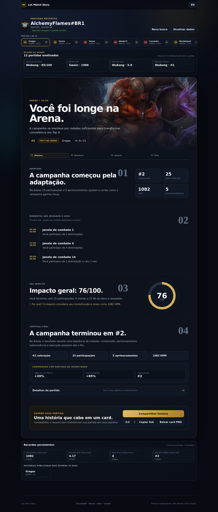
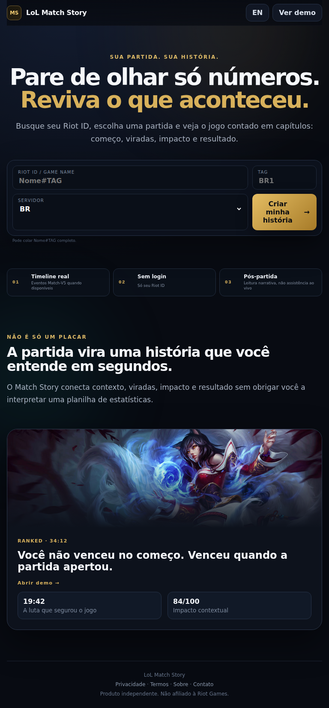
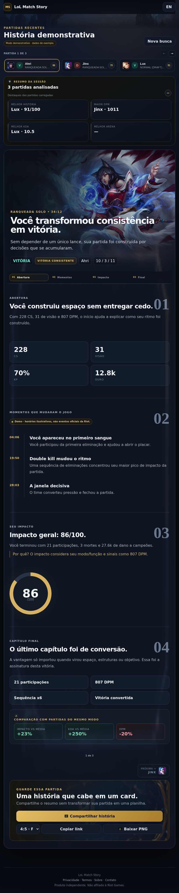
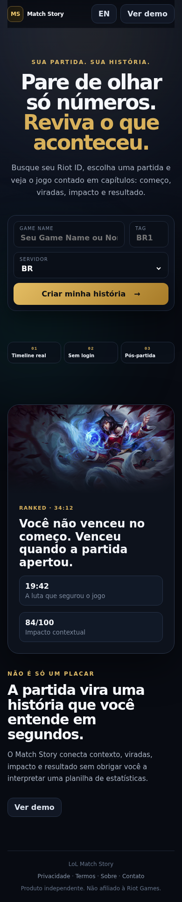
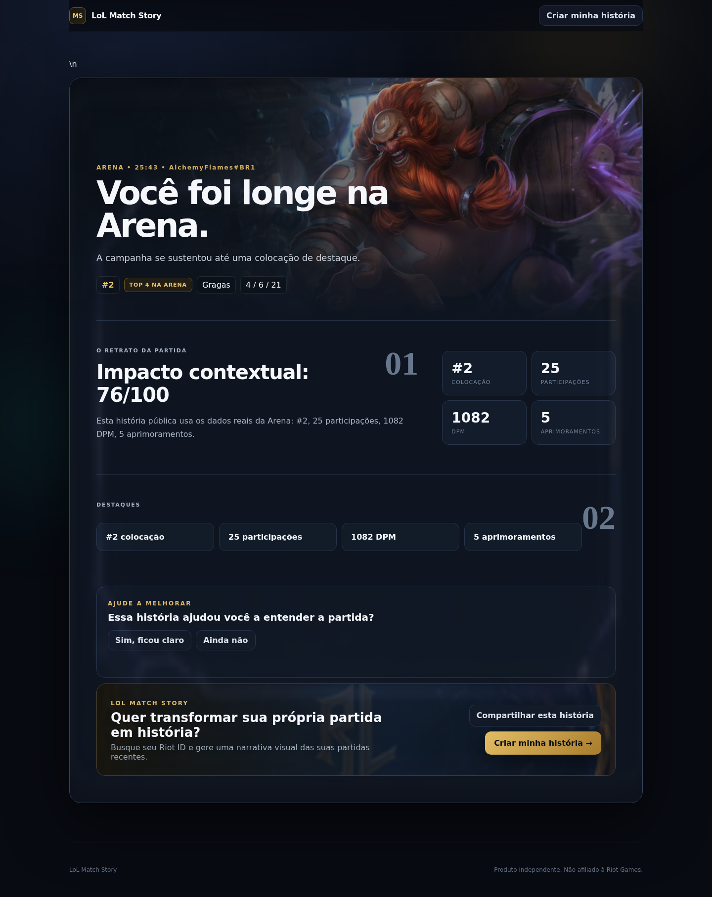
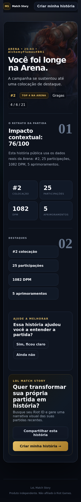
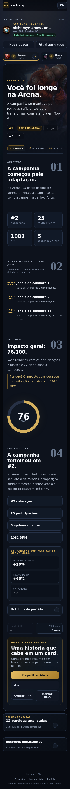

# Screenshots automáticos

Estas imagens são geradas pelo workflow **Capture Full Page Screenshots** sempre que arquivos visuais/funcionais principais mudam.

## Home — desktop

## Carregamento

## Perfil real — AlchemyFlames#BR1

O estado da consulta (`live`, `fallback-demo` ou `error`) fica registrado em `metadata.json`.

## História — desktop

## Home — tablet

## História — tablet

## Home — mobile

## História pública compartilhada

A captura usa uma história real persistida e registra em `metadata.json` se a página carregou ou ficou temporariamente indisponível.

## História pública — mobile

## Perfil real — mobile

## História — mobile

## Arquivos

- `latest-home-full.png` — página inicial inteira em desktop.
- `latest-loading-full.png` — skeleton de carregamento de uma consulta real.
- `latest-alchemy-full.png` — consulta automática do perfil real `AlchemyFlames#BR1`.
- `latest-story-full.png` — página inteira com uma história demo aberta em desktop.
- `latest-public-story-full.png` — página pública de uma história persistida em desktop.
- `latest-public-story-mobile-full.png` — mesma história pública em viewport mobile.
- `latest-tablet-home-full.png` — home inteira em 768×1024.
- `latest-tablet-story-full.png` — história demo inteira em 768×1024.
- `latest-mobile-home-full.png` — home inteira em viewport mobile.
- `latest-alchemy-mobile-full.png` — perfil real `AlchemyFlames#BR1` em mobile.
- `latest-mobile-full.png` — história demo inteira em viewport mobile.
- `metadata.json` — commit, data, URL-base e viewports usados.

O workflow também publica um artifact `full-page-screenshots` por 14 dias em cada execução.

### Como usar

1. Abra esta pasta no GitHub para revisar rapidamente o estado visual atual.
2. Consulte o histórico de commits dos PNGs para comparar versões anteriores.
3. Em **Actions → Capture Full Page Screenshots**, abra uma execução para baixar o artifact daquela versão.
4. O commit automático das imagens ignora deploy/versionamento para não criar loop.

As capturas são feitas com Playwright usando `fullPage: true`.

## Orçamento visual

Após gerar as imagens, o CI valida automaticamente limites para evitar regressões de comprimento e peso:

- home desktop: até **1800 px** de altura;
- perfil real AlchemyFlames desktop: até **4300 px**;
- história desktop: até **3800 px**;
- história pública desktop: até **3200 px**;
- história pública mobile: até **4200 px**;
- home tablet: até **2200 px**;
- história tablet: até **4400 px**;
- home mobile: até **2400 px**;
- história mobile: até **5600 px**;
- também valida largura esperada e tamanho máximo dos PNGs.

O comando local é `npm run check:visual`.
