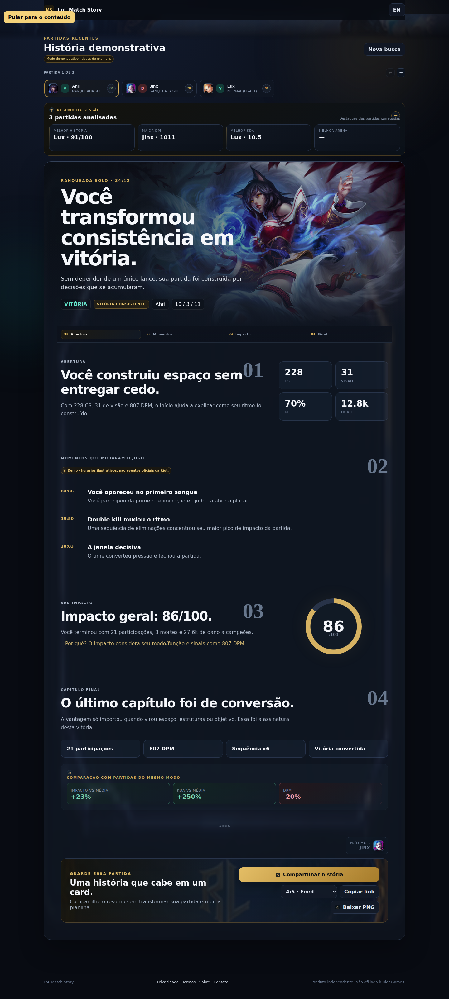
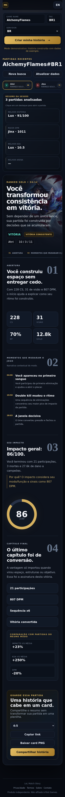

# Screenshots automáticos

Estas imagens são geradas pelo workflow **Capture Full Page Screenshots** sempre que arquivos visuais/funcionais principais mudam.

## Home — desktop

## História — desktop

## História — mobile

## Arquivos

- `latest-home-full.png` — página inicial inteira em desktop.
- `latest-story-full.png` — página inteira com uma história demo aberta em desktop.
- `latest-mobile-full.png` — história demo inteira em viewport mobile.
- `metadata.json` — commit, data, URL-base e viewports usados.

O workflow também publica um artifact `full-page-screenshots` por 14 dias em cada execução.

### Como usar

1. Abra esta pasta no GitHub para revisar rapidamente o estado visual atual.
2. Consulte o histórico de commits dos PNGs para comparar versões anteriores.
3. Em **Actions → Capture Full Page Screenshots**, abra uma execução para baixar o artifact daquela versão.
4. O commit automático das imagens ignora deploy/versionamento para não criar loop.

As capturas são feitas com Playwright usando `fullPage: true`.
